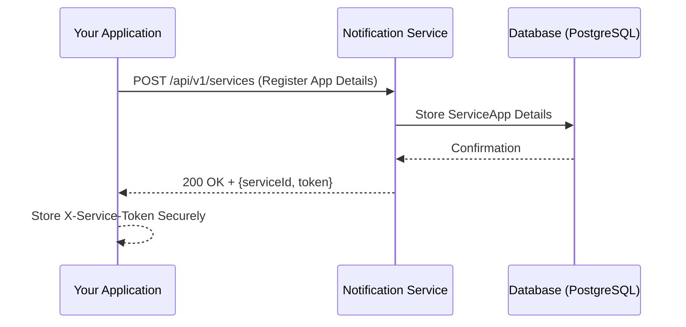
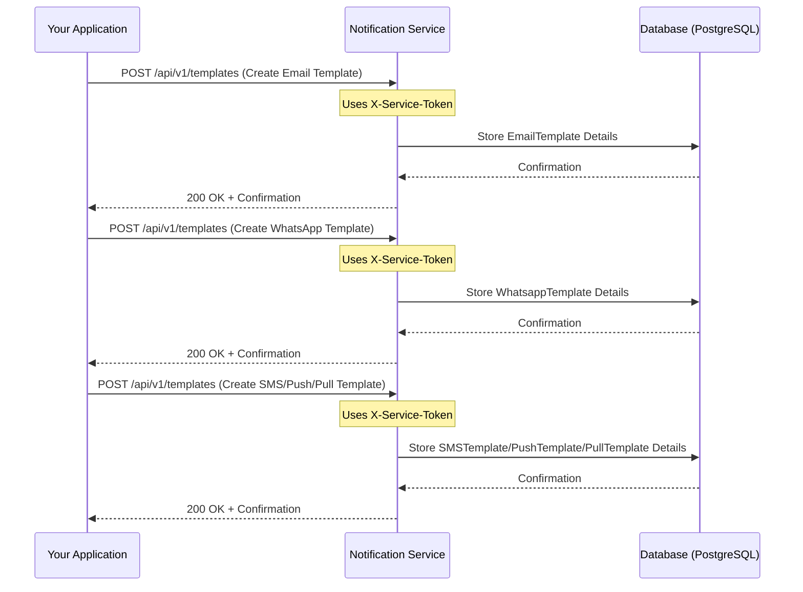
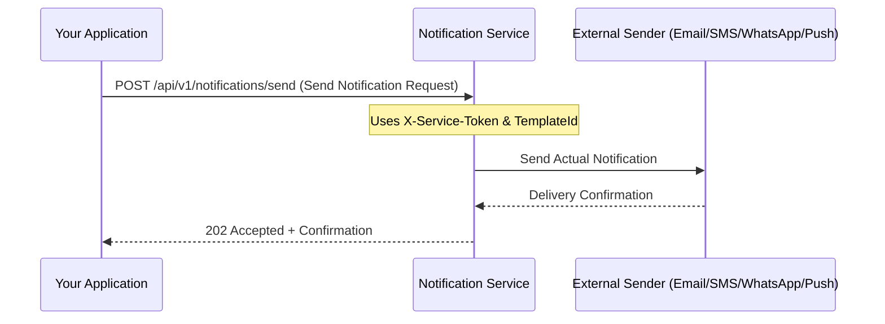
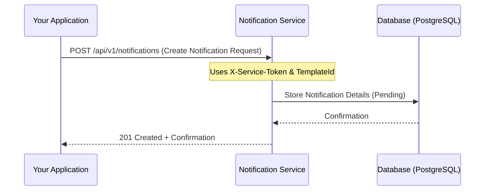
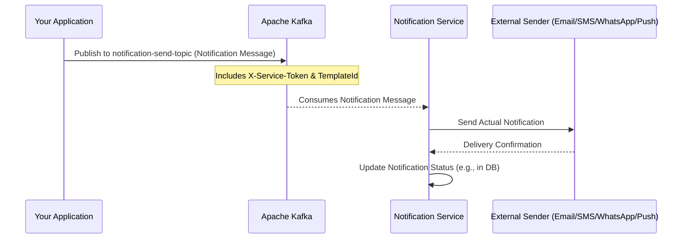

# 🎯 Notification Service

A comprehensive, reactive, and event-driven microservice for handling multi-channel notifications (Email, SMS, Push). Built with Spring Boot & Project Reactor, it leverages Kafka for asynchronous processing and provides a RESTful API for synchronous interactions.

[](https://opensource.oracle.com/licenses/upl)
[](https://spring.io/projects/spring-boot)
[](https://projectreactor.io/)
[](https://kafka.apache.org/)
[](https://www.postgresql.org/)
[](https://www.docker.com/)

---

## 📜 Table of Contents

1.  [Overview](#-overview)
2.  [Prerequisites & Installation](#-prerequisites--installation)
3.  [Kafka Integration](#-kafka-integration)
4.  [REST API Documentation](#-rest-api-documentation)
5.  [Usage with Kafka](#-usage-with-kafka)
6.  [Testing](#-testing)
7.  [Deployment](#-deployment)
8.  [Contributing](#-contributing)
9.  [License](#-license)

---

## 🔭 Overview

This service provides a centralized solution for managing and sending notifications. It is designed to be highly scalable and resilient, using a non-blocking stack and message queuing.

### Key Features

- **Multi-channel Notifications**: Send notifications via Email, SMS, WhatsApp, Push and Pull channels.
- **Service Registration**: Onboard new applications/services to use the notification system. Each registered service gets a unique token for API access.
- **Template Engine**: Create and manage notification templates to standardize communication.
- **Asynchronous by Default**: Operations are processed asynchronously via a Kafka message queue, ensuring high throughput.
- **Dual Interface**: Interact via a REST API for immediate requests or publish events to Kafka for decoupled, event-driven workflows.
- **Reactive Stack**: Built entirely on a reactive foundation (Spring WebFlux, R2DBC) for efficient resource utilization.

### Architecture

The application follows a standard Hexagonal Architecture pattern.

- **`application`**: Contains the core domain logic, services, and ports (interfaces).
- **`infrastructure`**: Provides the concrete implementations (adapters) for the ports, including:
  - REST Controllers (`web`)
  - Kafka Listeners (`listener.kafka`)
  - Database Repositories (`persistence`)

### Technologies

- **Java 21**
- **Spring Boot 3**
- **Spring WebFlux**: Reactive web framework.
- **Spring Data R2DBC**: Reactive database access.
- **PostgreSQL**: Relational database.
- **Spring for Apache Kafka**: Message queue integration.
- **Lombok**: Boilerplate code reduction.
- **Maven**: Dependency management.
- **Docker**: Containerization.
- **GitHub Actions**: CI/CD.

---

## 🛠️ Prerequisites & Installation

### Prerequisites

- **Java 21**: Ensure you have JDK 21 installed.
- **Maven 3.9+**: For building the project.
- **Docker & Docker Compose**: For running the application and its dependencies (Kafka, PostgreSQL).
- **Active Kafka & PostgreSQL instances**.
- **Firebase project**: for push notification, you need a Firebase project and the associated private key.

### Installation

1.  **Clone the repository:**

    ```bash
    git clone <repository-url>
    cd notification
    ```

2.  **Configure the environment:**
    Update the `src/main/resources/application.yml` file with your PostgreSQL and Kafka broker details.

    ```yaml
    spring:
      r2dbc:
        url: r2dbc:postgresql://<your-db-host>:<port>/<db-name>
        username: <your-db-user>
        password: <your-db-password>
      kafka:
        bootstrap-servers: <your-kafka-broker>:9092
        consumer:
          group-id: notification_group_id
    ```

3.  **Build the project:**
    The included Maven wrapper (`mvnw`) handles the build process.

    ```bash
    # On Linux/macOS
    ./mvnw clean install

    # On Windows
    ./mvnw.cmd clean install
    ```

4.  **Run the application:**
    Once built, you can run the application directly:

    ```bash
    java -jar target/*.jar
    ```

    Or, use Docker Compose for a complete environment (recommended).

---

## 🚀 How to Use the Notification Service

This section guides you through the typical workflow of using the Notification Service, from initial setup to sending multi-channel notifications.

### Step 1: Onboarding Your Application

Before you can send any notifications, you need to register your application with the Notification Service. This step provides you with a unique `X-Service-Token` that acts as your API key. For detailed instructions and examples, refer to the [Service Management](#1-service-management) section in the REST API Documentation.



### Step 2: Providing Notification Templates

Once your application is onboarded, you can define reusable templates for different notification types (Email, SMS, WhatsApp, Push, Pull). These templates standardize your messages and simplify sending. For detailed instructions and examples, refer to the [Template Management](#2-template-management) section in the REST API Documentation.



### Step 3: Sending Notifications

With your application registered and templates defined, you're ready to send notifications! You can do this either synchronously via the REST API or asynchronously via Kafka.

#### Option A: Sending Directly (REST API)

For immediate, direct notification sending. Refer to the [POST /api/v1/notifications/send](#post-apiv1notificationssend) section in the REST API Documentation for details and examples.



#### Option B: Creating for Later (REST API)

To store a notification for later processing or review, without immediate sending. Refer to the [POST /api/v1/notifications](#post-apiv1notifications) section in the REST API Documentation for details and examples.



#### Option C: Asynchronously via Kafka

For high-throughput, decoupled notification processing. Publish a message to the relevant Kafka topic. Refer to the [Usage with Kafka](#-usage-with-kafka) section for details and examples on how to use `notification-create-topic` and `notification-send-topic`.




---

## 📬 Kafka Integration

The service is deeply integrated with Kafka for asynchronous processing. All core actions can be triggered by publishing messages to specific topics.

### Kafka Topics

The application creates and listens to the following topics for handling notifications:

| Topic Name                  | Purpose                                    |
| --------------------------- | ------------------------------------------ |
| `notification-create-topic` | To create a notification to be sent later. |
| `notification-send-topic`   | To send a notification immediately.        |

Service and template management are performed exclusively via the [REST API](#-rest-api-documentation) to ensure transactional integrity and immediate feedback.

### Security: `X-Service-Token` Header

For security, most Kafka messages require a header named `X-Service-Token`. This header must contain the unique token generated when a service was registered. **Messages without a valid token on protected topics will be rejected.**

### Message Schema

All messages are in JSON format. The structure for each topic is detailed in the [Usage with Kafka](#-usage-with-kafka) section.

---

## 🌐 REST API Documentation

The REST API provides a synchronous way to interact with the service.

### Authentication

All endpoints (except for service registration) are protected and require the `X-Service-Token` header to be present with a valid service token.

---

### 1. Service Management

#### POST `/api/v1/services`

Registers a new service application. This is the first step to using the notification service. The response contains the `serviceId` and the all-important `token` needed for all other API calls.

- **Method**: `POST`
- **URL**: `/api/v1/services`
- **Headers**:

  - `Content-Type: application/json`

- **Request Body**:

  ```json
  {
    "name": "My Awesome App",
    "emailServerHost": "smtp.example.com",
    "emailServerPort": "587",
    "emailUsername": "user@example.com",
    "emailPassword": "your-smtp-password",
    "smsServerHost": "sms.provider.com",
    "smsServerPort": "8080",
    "smstoken": "your-sms-provider-token",
    "whatsappApiUrl": "https://715.api.greenapi.com/",
    "whatsappIdInstance": "your-instance-id",
    "whatsappApiTokenInstance": "your-api-token",
    "firebaseServiceAccountJson": "{\"type\": \"service_account\", ...}"
  }
  ```

- **Response (200 OK)**:

  ```json
  {
    "serviceId": 1,
    "name": "My Awesome App",
    "token": "a-unique-generated-secret-token"
  }
  ```

- **cURL Example**:
  ```bash
  curl -X POST 'http://localhost:8080/api/v1/services' \
  -H 'Content-Type: application/json' \
  -d '{
    "name": "My Awesome App",
    "emailServerHost": "smtp.example.com",
    "emailServerPort": "587",
    "emailUsername": "user@example.com",
    "emailPassword": "your-smtp-password",
    "smsServerHost": "sms.provider.com",
    "smsServerPort": "8080",
    "smstoken": "your-sms-provider-token",
    "whatsappApiUrl": "https://715.api.greenapi.com/",
    "whatsappIdInstance": "your-instance-id",
    "whatsappApiTokenInstance": "your-api-token",
    "firebaseServiceAccountJson": "{\"type\": \"service_account\", ...}"
  }'
  ```

#### PATCH `/api/v1/services`

Updates specific sender configurations for a registered service application. This endpoint allows for partial updates, meaning you only send the fields you wish to change for one or more sender types.

- **Method**: `PATCH`
- **URL**: `/api/v1/services/{serviceAppId}`
- **Headers**:
  - `Content-Type: application/json`
  - `X-Service-Token: <your-service-token>` **(Required)**

- **Request Body Examples**:

  **Updating Email Sender Configuration**:
  ```json
  {
    "emailSender": {
      "serverHost": "new.smtp.server.com",
      "username": "newuser@example.com",
      "password": "new-smtp-password"
    }
  }
  ```

  **Updating SMS Sender Configuration**:
  ```json
  {
    "smsSender": {
      "serverHost": "new.sms.provider.com",
      "token": "new-sms-token"
    }
  }
  ```

  **Updating Push Sender Configuration**:
  ```json
  {
    "pushSender": {
      "serviceAccountJson": "{\"type\": \"new_service_account\", ...}"
    }
  }
  ```

  **Updating WhatsApp Sender Configuration**:
  ```json
  {
    "whatsappSender": {
      "apiUrl": "https://new.api.whatsapp.com/",
      "idInstance": "new-whatsapp-instance-id",
      "apiTokenInstance": "new-whatsapp-api-token"
    }
  }
  ```
  **Simultaneous Update (Example)**:
  You can update multiple sender types in a single request:
  ```json
  {
    "emailSender": {
      "serverHost": "another.smtp.server.com"
    },
    "smsSender": {
      "serverHost": "another.sms.provider.com",
      "serverPort": "9090"
    }
  }
  ```
  Only the fields provided in the request body for each sender type will be updated. Other fields and sender types not included in the request will remain unchanged.

- **Response (204 No Content)**:
  No content is returned upon successful update.

- **cURL Example (Updating Email Sender)**:
  ```bash
  curl -X PATCH 'http://localhost:8080/api/v1/services' \
  -H 'Content-Type: application/json' \
  -H 'X-Service-Token: <your-service-token>' \
  -d '{
    "emailSender": {
      "serverHost": "new.smtp.server.com",
      "username": "newuser@example.com",
      "password": "new-smtp-password"
    }
  }'
  ```
  Replace `<your-service-token>` with the service's token.

---

### 2. Template Management

#### POST `/api/v1/templates`

Creates a new notification template for a registered service.

- **Method**: `POST`
- **URL**: `/api/v1/templates`
- **Headers**:

  - `Content-Type: application/json`
  - `X-Service-Token: <your-service-token>` **(Required)**

- **Request Body**:

  ```json
  {
    "templateId": 101,
    "fromEmail": "noreply@myawesomeapp.com",
    "name": "Welcome Email",
    "description": "Template for welcoming new users.",
    "subject": "Welcome to My Awesome App!",
    "bodyHtml": "<h1>Welcome, {{userName}}!</h1><p>Thank you for joining.</p>",
    "type": "EMAIL"
  }
  ```

  Or for WHATSAPP:

  ```json
  {
    "templateId": 102,
    "name": "Order Confirmation Whatsapp",
    "description": "Template for WhatsApp order confirmation.",
    "body": "Hello {{customerName}}, your order {{orderId}} has been confirmed!",
    "type": "WHATSAPP"
  }
  ```
  
  Or for PUSH:

  ```json
  {
    "templateId": 103,
    "name": "New Order Push Notification",
    "description": "Template for new order push notifications.",
    "title": "New Order Received!",
    "body": "You have a new order from {{customerName}}.",
    "type": "PUSH"
  }
  ```

  - `type` can be `EMAIL`, `SMS`, `WHATSAPP`, `PUSH` or `PULL`.
  - `message` is used for SMS and PULL. `body` is used for WHATSAPP and PUSH. `title` is used for PUSH. `subject` and `bodyHtml` are for EMAIL.

- **Response (200 OK)**:

  ```json
  {
    "message": "template successfully created"
  }
  ```

- **cURL Example**:
  ```bash
  curl -X POST 'http://localhost:8080/api/v1/templates' \
  -H 'Content-Type: application/json' \
  -H 'X-Service-Token: <your-service-token>' \
  -d '{
    "templateId": 101,
    "fromEmail": "noreply@myawesomeapp.com",
    "name": "Welcome Email",
    "description": "Template for welcoming new users.",
    "subject": "Welcome to My Awesome App!",
    "bodyHtml": "<h1>Welcome, {{userName}}!</h1><p>Thank you for joining.</p>",
    "type": "EMAIL"
  }'
  ```
  Or for WHATSAPP:
  ```bash
  curl -X POST 'http://localhost:8080/api/v1/templates' \
  -H 'Content-Type: application/json' \
  -H 'X-Service-Token: <your-service-token>' \
  -d '{
    "templateId": 102,
    "name": "Order Confirmation Whatsapp",
    "description": "Template for WhatsApp order confirmation.",
    "body": "Hello {{customerName}}, your order {{orderId}} has been confirmed!",
    "type": "WHATSAPP"
  }'
  ```
  Or for PUSH:
  ```bash
  curl -X POST 'http://localhost:8080/api/v1/templates' \
  -H 'Content-Type: application/json' \
  -H 'X-Service-Token: <your-service-token>' \
  -d '{
    "templateId": 103,
    "name": "New Order Push Notification",
    "description": "Template for new order push notifications.",
    "title": "New Order Received!",
    "body": "You have a new order from {{customerName}}.",
    "type": "PUSH"
  }'
  ```

---

### 3. Notification Management

#### POST `/api/v1/notifications`

Creates a notification without sending it immediately. This is useful for scheduling or review processes.

- **Method**: `POST`
- **URL**: `/api/v1/notifications`
- **Headers**:

  - `Content-Type: application/json`
  - `X-Service-Token: <your-service-token>` **(Required)**

- **Request Body**:

  ```json
  {
    "notificationType": "EMAIL",
    "templateId": 101,
    "userId": "a-user-uuid-if-exists",
    "data": {
      "userName": "John Doe"
    }
  }
  ```

  Or for WHATSAPP:

  ```json
  {
    "notificationType": "WHATSAPP",
    "templateId": 102,
    "userId": "a-user-uuid-if-exists",
    "data": {
      "customerName": "Jane Doe",
      "orderId": "XYZ-123"
    }
  }
  ```
  
  Or for PUSH:
  
  ```json
  {
    "notificationType": "PUSH",
    "templateId": 103,
    "userId": "a-user-uuid-if-exists",
    "data": {
      "customerName": "Jane Doe"
    }
  }
  ```

  - `data` contains key-value pairs to replace variables in the template (e.g., `{{userName}}`).

- **Response (200 OK)**:

  ```json
  {
    "message": "notification successfully created"
  }
  ```

- **cURL Example**:
  ```bash
  curl -X POST 'http://localhost:8080/api/v1/notifications' \
  -H 'Content-Type: application/json' \
  -H 'X-Service-Token: <your-service-token>' \
  -d '{
    "notificationType": "EMAIL",
    "templateId": 101,
    "userId": "a-user-uuid-if-exists",
    "data": {
      "userName": "John Doe"
    }
  }'
  ```
  Or for WHATSAPP:
  ```bash
  curl -X POST 'http://localhost:8080/api/v1/notifications' \
  -H 'Content-Type: application/json' \
  -H 'X-Service-Token: <your-service-token>' \
  -d '{
    "notificationType": "WHATSAPP",
    "templateId": 102,
    "userId": "a-user-uuid-if-exists",
    "data": {
      "customerName": "Jane Doe",
      "orderId": "XYZ-123"
    }
  }'
  ```
  
  Or for PUSH:
  ```bash
  curl -X POST 'http://localhost:8080/api/v1/notifications' \
  -H 'Content-Type: application/json' \
  -H 'X-Service-Token: <your-service-token>' \
  -d '{
    "notificationType": "PUSH",
    "templateId": 103,
    "userId": "a-user-uuid-if-exists",
    "data": {
      "customerName": "Jane Doe"
    }
  }'
  ```

#### POST `/api/v1/notifications/send`

Sends a notification immediately to a specified recipient.

- **Method**: `POST`
- **URL**: `/api/v1/notifications/send`
- **Headers**:

  - `Content-Type: application/json`
  - `X-Service-Token: <your-service-token>` **(Required)**

- **Request Body**:

  ```json
  {
    "notificationType": "EMAIL",
    "templateId": 101,
    "to": ["john.doe@email.com"],
    "data": {
      "userName": "John Doe"
    }
  }
  ```

  Or for WHATSAPP:

  ```json
  {
    "notificationType": "WHATSAPP",
    "templateId": 102,
    "to": ["1234567890"],
    "data": {
      "customerName": "Jane Doe",
      "orderId": "XYZ-123"
    }
  }
  ```
  
  Or for PUSH:
  
  ```json
  {
    "notificationType": "PUSH",
    "templateId": 103,
    "to": ["<device-token>"],
    "data": {
      "customerName": "Jane Doe"
    }
  }
  ```

  - `to` is the recipient's address (e.g., email address, phone number, device token).

- **Response (200 OK)**:

  ```json
  {
    "message": "notification successfully sent"
  }
  ```

- **cURL Example**:
  ```bash
  curl -X POST 'http://localhost:8080/api/v1/notifications/send' \
  -H 'Content-Type: application/json' \
  -H 'X-Service-Token: <your-service-token>' \
  -d '{
    "notificationType": "EMAIL",
    "templateId": 101,
    "to": ["john.doe@email.com"],
    "data": {
      "userName": "John Doe"
    }
  }'
  ```
  Or for WHATSAPP:
  ```bash
  curl -X POST 'http://localhost:8080/api/v1/notifications/send' \
  -H 'Content-Type: application/json' \
  -H 'X-Service-Token: <your-service-token>' \
  -d '{
    "notificationType": "WHATSAPP",
    "templateId": 102,
    "to": ["1234567890"],
    "data": {
      "customerName": "Jane Doe",
      "orderId": "XYZ-123"
    }
  }'
  ```
  
  Or for PUSH:
  ```bash
  curl -X POST 'http://localhost:8080/api/v1/notifications/send' \
  -H 'Content-Type: application/json' \
  -H 'X-Service-Token: <your-service-token>' \
  -d '{
    "notificationType": "PUSH",
    "templateId": 103,
    "to": ["<your-device-token>"],
    "data": {
      "customerName": "Jane Doe"
    }
  }'
  ```

---

## 📬 Usage with Kafka

You can trigger notification creation and sending by publishing messages to the Kafka topics. This is the preferred method for asynchronous, decoupled systems.

**Note**: Service registration and template creation are only available via the [REST API](#-rest-api-documentation).

### 1. Create a Notification

- **Topic**: `notification-create-topic`
- **Headers**:
  - `X-Service-Token`: `<your-service-token>` **(Required)**
- **Message Payload**:
  Same as the REST request body for `POST /api/v1/notifications`.
  ```json
  {
    "notificationType": "EMAIL",
    "templateId": 102,
    "userId": "some-user-uuid",
    "data": { "userName": "Jane Kafka" }
  }
  ```
  Or for WHATSAPP:
  ```json
  {
    "notificationType": "WHATSAPP",
    "templateId": 102,
    "userId": "some-user-uuid",
    "data": { "customerName": "Jane Kafka", "orderId": "XYZ-456" }
  }
  ```
  
  Or for PUSH:
  ```json
  {
    "notificationType": "PUSH",
    "templateId": 103,
    "userId": "some-user-uuid",
    "data": { "customerName": "Jane Kafka" }
  }
  ```

### 2. Send a Notification

- **Topic**: `notification-send-topic`
- **Headers**:
  - `X-Service-Token`: `<your-service-token>` **(Required)**
- **Message Payload**:
  Same as the REST request body for `POST /api/v1/notifications/send`.
  ```json
  {
    "notificationType": "SMS",
    "templateId": 103,
    "to": ["1234567890"],
    "data": { "orderId": "XYZ-123" }
  }
  ```
  Or for WHATSAPP:
  ```json
  {
    "notificationType": "WHATSAPP",
    "templateId": 102,
    "to": ["1234567890"],
    "data": { "customerName": "Jane Kafka", "orderId": "XYZ-789" }
  }
  ```
  
  Or for PUSH:
  ```json
  {
    "notificationType": "PUSH",
    "templateId": 103,
    "to": ["<your-device-token>"],
    "data": { "customerName": "Jane Kafka" }
  }
  ```

---

## 🧪 Testing

The project uses JUnit 5 for testing. The CI/CD pipeline is configured to run tests automatically on every push.

To run tests locally:

```bash
./mvnw test
```

Or, to run verification which includes tests:

```bash
./mvnw clean verify
```

The main integration test class `NotificationApplicationTests.java` ensures that the Spring application context loads correctly.

---

## 🚀 Deployment

The application is designed to be deployed as a Docker container.

### Building the Docker Image

The `Dockerfile` in the root directory defines a multi-stage build process.

1.  **Build the image locally:**
    ```bash
    docker build -t notification-service .
    ```

### Running with Docker Compose

For a full local environment, a `docker-compose.yml` file is recommended to orchestrate the `notification-service`, a PostgreSQL database, and a Kafka cluster.

Example `docker-compose.yml`:

```yaml
version: "3.8"
services:
  postgres:
    image: postgres:15
    environment:
      POSTGRES_USER: user
      POSTGRES_PASSWORD: password
      POSTGRES_DB: notification_db
    ports:
      - "5432:5432"

  kafka:
    image: "bitnami/kafka:latest"
    ports:
      - "9092:9092"
    environment:
      - KAFKA_CFG_NODE_ID=0
      - KAFKA_CFG_PROCESS_ROLES=controller,broker
      - KAFKA_CFG_LISTENERS=PLAINTEXT://:9092,CONTROLLER://:9093
      - KAFKA_CFG_LISTENER_SECURITY_PROTOCOL_MAP=CONTROLLER:PLAINTEXT,PLAINTEXT:PLAINTEXT
      - KAFKA_CFG_CONTROLLER_QUORUM_VOTERS=0@kafka:9093
      - KAFKA_CFG_BROKER_ID=0

  notification-service:
    build: .
    ports:
      - "8080:8080"
    depends_on:
      - postgres
      - kafka
    environment:
      - SPRING_R2DBC_URL=r2dbc:postgresql://postgres:5432/notification_db
      - SPRING_R2DBC_USERNAME=user
      - SPRING_R2DBC_PASSWORD=password
      - SPRING_KAFKA_BOOTSTRAP_SERVERS=kafka:9092
```

Run `docker-compose up` to start all services.

### CI/CD Pipeline

The repository is configured with a GitHub Actions workflow in `.github/workflows/ci-cd.yml` which automates:

1.  **Testing**: Runs `mvn clean verify` on every push to any branch.
2.  **Building**: On a push to the `main` branch, it builds a Docker image.
3.  **Publishing**: It pushes the built image to GitHub Container Registry (ghcr.io).
4.  **Deploying**: It connects to a remote server via SSH and uses `docker compose` to pull the latest image and restart the service.

---

## 🙌 Contributing

Contributions are welcome! Please follow these guidelines:

- **Branching**: Create a new branch for each feature or bug fix (`feature/my-new-feature` or `fix/issue-description`).
- **Code Style**: Adhere to the existing code style.
- **Tests**: Add unit or integration tests for any new functionality.
- **Pull Requests**: Open a pull request against the `main` branch. Provide a clear description of the changes.

---

## 👨‍💻 Author

This service was written by **Tchassi Daniel**.

- **Email**: [tchassidaniel@gmail.com](mailto:tchassidaniel@gmail.com)
- **GitHub**: [TchassiDaniel](https://github.com/TchassiDaniel)
- **LinkedIn**: [in/tchassidaniel](https://www.linkedin.com/in/tchassidaniel)

---

## ⚖️ License

This project is proprietary. Please refer to the `LICENSE` file for details. (Note: A `LICENSE` file was not found in the project).
